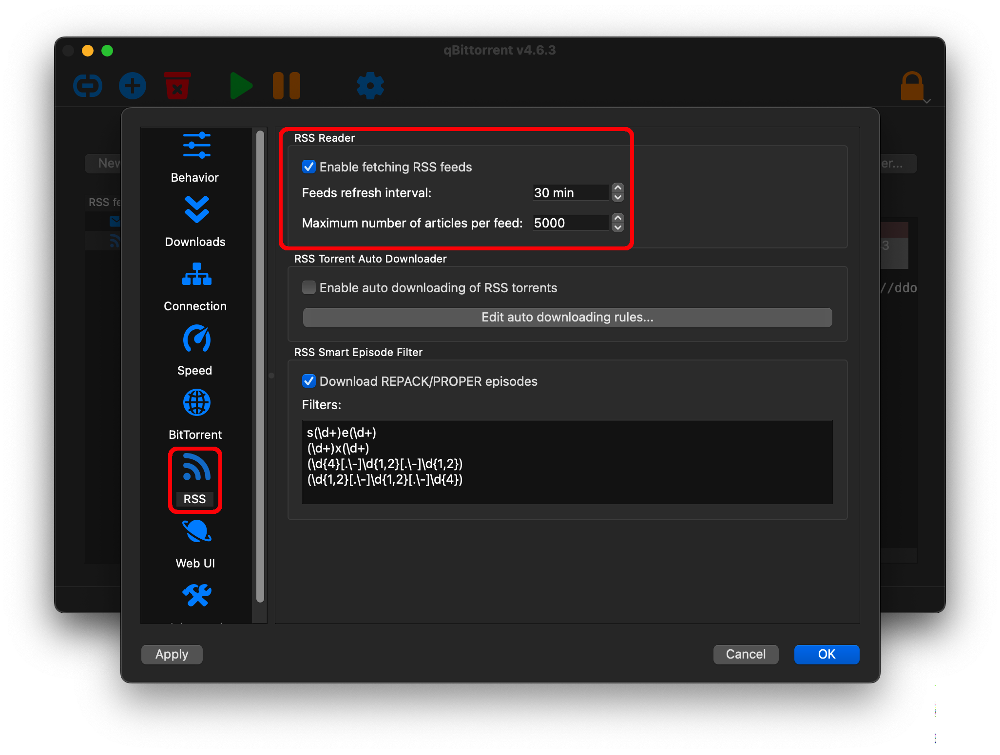
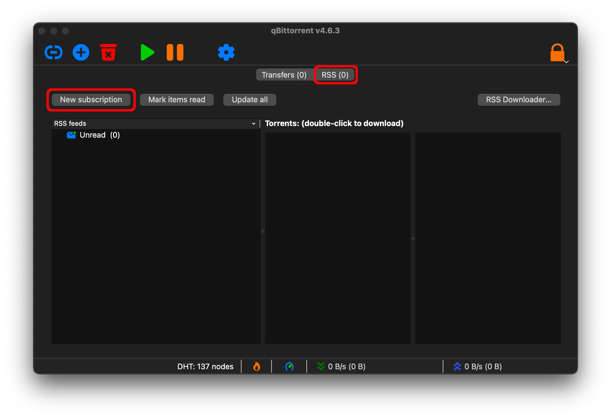
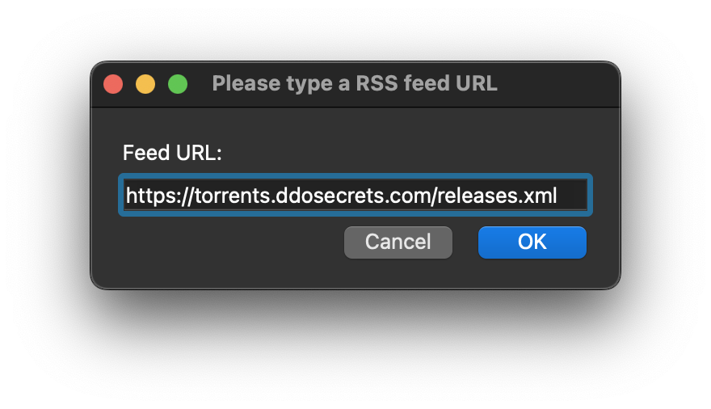
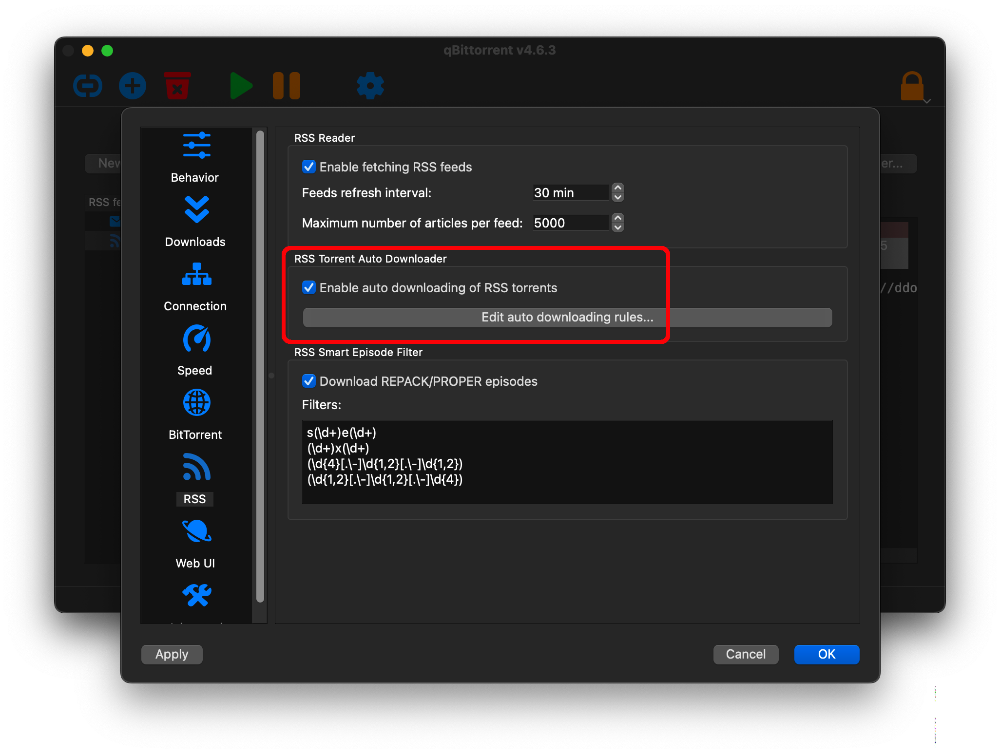

# Mirroring DDoSecrets Releases Via Torrent

This is a guide to downloading public datasets from Distributed Denial of Secrets via torrent, and subscribing to future releases preemptively.

## The Short Version for Experts

You can view [a list of all our torrents here.](https://torrents.ddosecrets.org/) The list is available as CSV, RSS, and as individual download buttons for each magnet link. If your torrent client supports RSS feeds ([uTorrent](https://www.utorrent.com/) and [qBittorrent](https://www.qbittorrent.org/) both do) then [subscribe to our feed](https://torrents.ddosecrets.org/releases.xml) to view all our magnet links in your client. If your torrent client does _not_ support RSS feeds (such as [Transmission](https://transmissionbt.com/)) then you may want to add a cronjob to download the CSV file of releases regularly and add them. The following line will add all new torrents to transmission if it's running as a daemon:

```bash
curl --silent https://torrents.ddosecrets.org/magnets.csv | grep "magnet:" | cut -d, -f2- | while read -r; do transmission-remote -a "$REPLY"; done
```

## Step By Step

We recommend using [qBittorrent](https://www.qbittorrent.org/) to subscribe to our releases. Start by downloading a copy of the software, and we'll walk through enabling RSS subscriptions, adding a subscription to DDoSecrets data, and starting some downloads.

Once you open qBittorrent, navigate to the settings panel:


Select the RSS tab on the left, make the highlighted changes, then press "Apply."



Next, navigate to "View" and enable the RSS Reader:


Now an RSS feed tab should appear on the main window. Select it and press "New subscription":



Add [our RSS feed URL for DDoSecrets public releases](https://torrents.ddosecrets.org/releases.xml):



All of our releases should now appear in your torrent client. Double-clicking on any of them will start a download:


Your torrent client will automatically refresh the RSS feed every half-hour, so new releases will appear in this list as they become available.

## How to Start Downloads Automatically

If you follow the screenshots above then your torrent client will download the list of available DDoSecrets releases, but it will not download any of the associated files without your explicit consent.

Some readers may wish to automatically download new releases, so that you have a complete mirror of all Distributed Denial of Secrets public releases at all times. Be warned: at the time of writing **this is over 60 TB of data.**

If you wish to make a complete mirror and have the capacity to do so then return to the RSS settings menu and enable the following checkbox:


